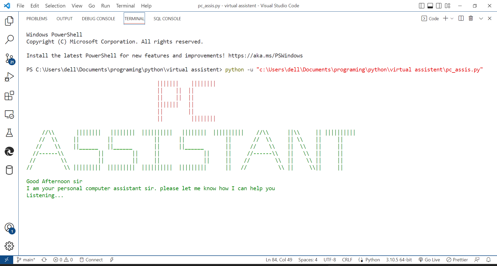
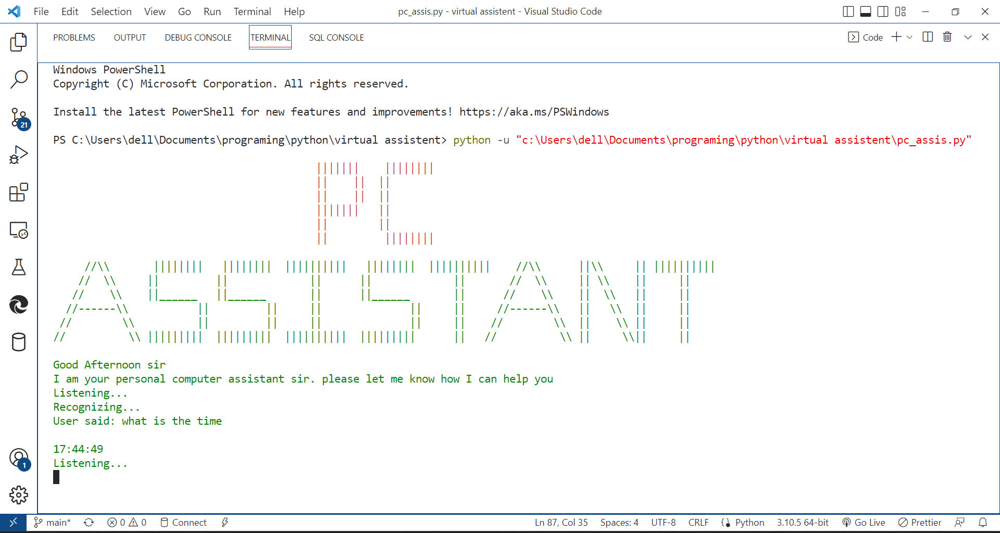
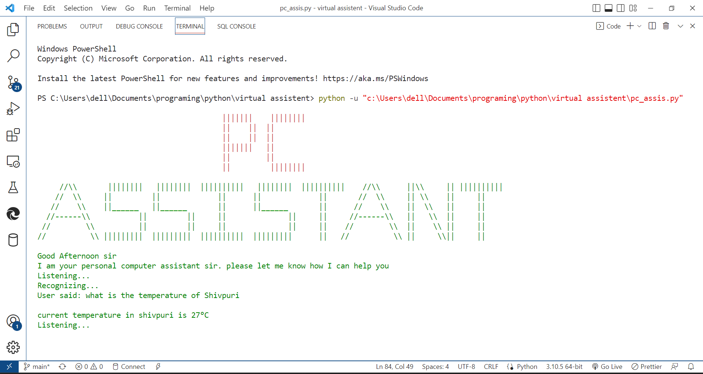
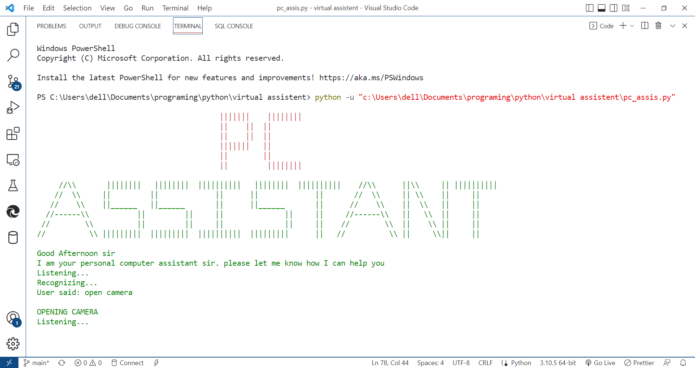
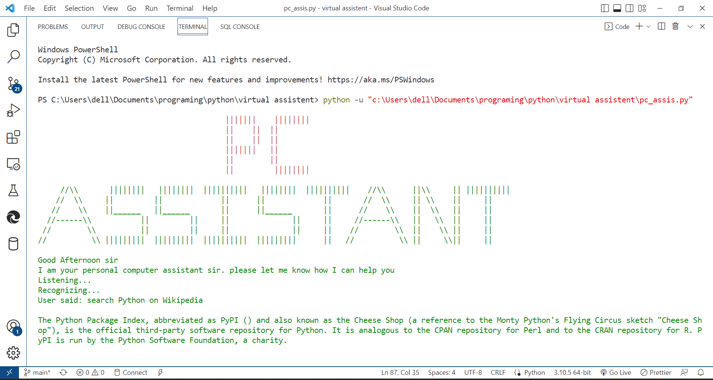
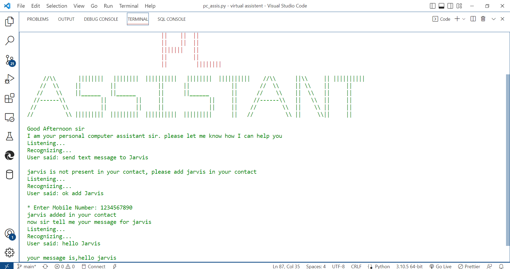
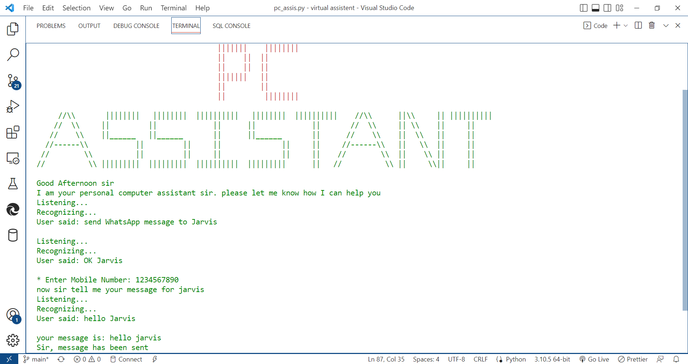
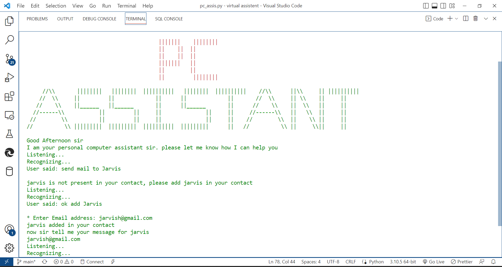

## *Personal Computer Assistant*

>**Introduction**

The virtual assistant is a general-purpose desktop-based application software, that understands voice commands and completes tasks or replies to queries said by the user. 

>**Why did i make this project**

In the current scenario, advancements in technologies are such that they can perform any task with the same effectiveness or can say more effectively than us. By making this project, we realized that the concept of AI in every field is decreasing human effort and saving time.
>**Working**

- PC Assistant can assist you by showing you the correct time, with the help of the command “what s the time”. 
- PC Assistant can assist you by searching for the desired result you want to find from Wikipedia by using the command “Search (Topic Name) on Wikipedia” 
- PC Assistant can open any youtube video by using the command “Play (Song Name) on youtube” 
- PC Assistant can open any webpage by using the command “Open (Website Name)” 
- PC Assistant can open any application by using the command “Open (Application Name)” 
- PC Assistant can tell you the temperature of your city by using the command “What is The Temperature of (City Name)” 
- PC Assistant can take the screenshot by using the command “Take a Screenshot”
- PC Assistant can send mail by using the command “Sends Mail To (Name of a Person)”
- PC Assistant can send a message by using the command “Sends Message to (Name of a Person)”
- PC Assistant can Lock, Restart, Shutdown your PC by using the command “Lock My PC / Shut down my PC / Restart My PC”
>**Technology used**
- Programming Language: Python
- Code Editor: Visual Studio Code
- Python libraries
  - os       
  - pyttsx3
  - datetime
  - requests
  - pywhatkit
  - wikipedia
  - webbrowser
  - speech_recognition
  - AppOpener
  - BeautifulSoup

>**Commands**

1. `Sends Mail To (Name of a Person) `
2. `Sends Message to (Name of a Person) `
3. `Take a ScreenShot `
4. `What is The Temperature of (City Name) `
5. `Search (Topic Name) `
6. `Play (Song Name) on youtube `
7. `Search (Topic Name) on Wikipedia `
8. `Open (Application Name) `
9. `What is the time `
10. `Lock My PC / Shut down my PC / Restart My PC `
11. `Exit: used for closing the program`

 

>**Screenshots**

###### Starting:

###### Current time:

  - Command: `What is the time`

###### Temperature:

  - Command: `what is the temperature of <place name>`

###### Open any application

  - Command: `open <application name>`

###### Search on Wikipedia

  - Command: `search python on Wikipedia`

###### Send Text Message:

  - Command: `send text message to <name of person>`

###### Send WhatsApp Message:

  - Command: `send WhatsApp message to <name of person>`

###### Send Mail:

  - Command: `send mail to <name of person`

>**Conclusion**

Personal Assistant is a very helpful voice assistant without any doubt as it saves time of the user by conversational interactions, its effectiveness and efficiency. Controlled Devices uses Natural Language Processing to process the language spoken by the human and understand the query and process the query and respond to the human with the result. The understanding of the Assistant means Artificial Intelligence needs to be integrated with the Assistant so that the Assistant can work in a smart way and can also control IoT applications and devices and can also respond to query which will search the web for results and process it

>**Team Members**

- Anamika Mudotiya
- Ayush Khan
- Dev Namdev
- Monika Namdev
- Princy Goyal
- Shubham Kumar Mishra